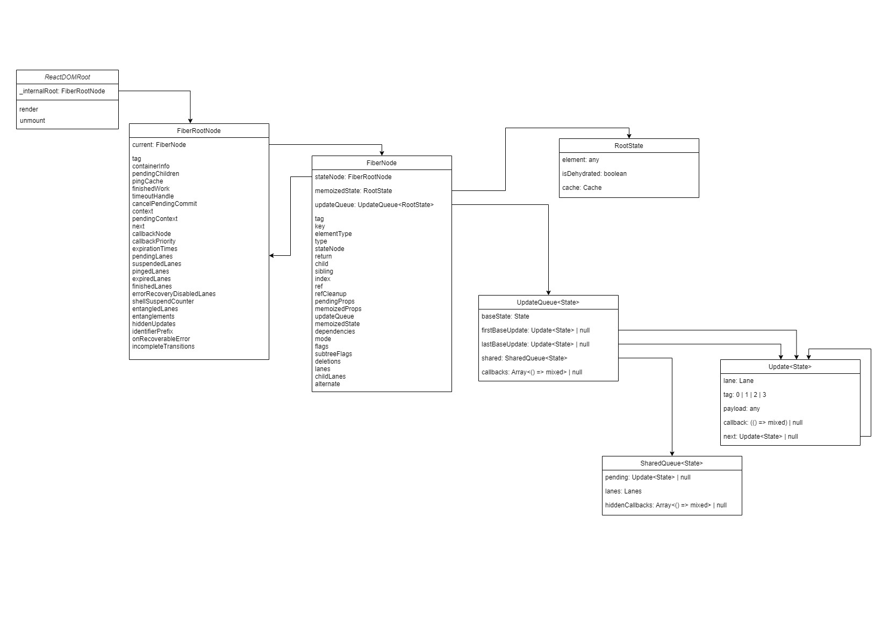

# `createRoot` の動作

React のチュートリアルやドキュメントに従う際に React を使用するための最初のステップは、以下のようになります。

1. `react-dom/client`から`createRoot`をインポート
2. `container`を提供して`createRoot`を呼び出す
3. `root`オブジェクトから`render`関数を呼び出す

```tsx
import { App } from "./app";
import { createRoot } from "react-dom/client";

const container = document.getElementById("root");

// This is the first step
// highlight-next-line
const root = createRoot(container);

// Then, the second
// highlight-next-line
root.render(<App />);
```

このセクションでは、`createRoot`（最初のステップ）について、そのシグネチャ、`root`オブジェクトを作成する目的、およびその正確な内容についてを見ていきます。

## シグネチャ

`createRoot` は次のように定義されています。
[このリンク](https://github.com/facebook/react/blob/e50531692010bbda2a4627b07c7c810c3770a52a/packages/react-dom/src/client/ReactDOM.js#L115)からも確認できます。

```typescript
function createRoot(
  container: Element | Document | DocumentFragment,
  options?: CreateRootOptions
): RootType {
  /* [Not Native code] */
}
```

<!-- `createRoot` accepts a DOM `Node` and returns an object
of type `RootType` (The dom node is often called the `HostRoot`) that you will
use to render your application. We will see the returned object in details
later in this section. -->

`createRoot`は、DOM ノード(`Node`)を受け入れます。
また、アプリケーションをレンダリングするために使用する`RootType`型のオブジェクトを返します
(このノードは通常、`HostRoot`と呼ばれます)。

このセクションの後半で、詳細について説明します。

<!-- The second optional argument of `createRoot` is an `options` object. Up until
writing these words, here is the following supported options: -->

`createRoot`の第二引数はオプションです。
これまでのところ、以下のサポートされているオプションがあります。

| Property                              | Type                         | Description                                                                                                  |
| ------------------------------------- | ---------------------------- | ------------------------------------------------------------------------------------------------------------ |
| `unstable_strictMode`                 | `boolean`                    | Enable/disable StrictMode at root level                                                                      |
| `unstable_concurrentUpdatesByDefault` | `boolean`                    | Make concurrent updates the default for a root.                                                              |
| `unstable_transitionCallbacks`        | `TransitionTracingCallbacks` | I don't know what are these. It will be documented/edited when we get to it.                                 |
| `identifierPrefix`                    | `string`                     | React Flight root's identifierPrefix.                                                                        |
| `onRecoverableError`                  | `(error: any) => void`       | Callback when React auto recovers from errors. Try it [here](https://codesandbox.io/s/stoic-glitter-sstwtq). |

<!-- `TransitionTracingCallbacks` are defined [here](https://github.com/facebook/react/blob/fc801116c80b68f7ebdaf66ac77d5f2dcd9e50eb/packages/react-reconciler/src/ReactInternalTypes.js#L292). -->

`TransitionTracingCallbacks` は[ここ](https://github.com/facebook/react/blob/fc801116c80b68f7ebdaf66ac77d5f2dcd9e50eb/packages/react-reconciler/src/ReactInternalTypes.js#L292)で定義されています。

:::note
`unstable_`接頭辞が付いている場合、そのオプションはまだ開発中または実験的であることを意味します。
安定してドキュメント化された場合、`unstable_`接頭辞は削除され、名前が変更される可能性があります。

したがって、実験的で不安定な API は、その管理ができると完全に自信がある場合を除いては避けるべきです（次の開発者に指示するためのコメントを残すのを忘れないでください 😉）。
:::

ルートオブジェクトは、React がアプリケーション全体をレンダリングし、時間の経過とともに管理するために使用されます。
したがって、アプリケーションの重要な役割を果たします。いつでもツリーの状態を知り、操作できるだけの情報があります。

## 実装

### TL;DR

import { S_01_CREATE_ROOT_1 } from "./components/EL/stacks";
import { EventLoopComponent, AnimatedEventLoop } from "./components/EL";

<AnimatedEventLoop stack={S_01_CREATE_ROOT_1} showCallbackQueue={false} />

### 1. `container` の有効性の確認

```tsx
if (!isValidContainer(container)) {
  throw new Error("createRoot(...): Target container is not a DOM element.");
}
```

<!-- Valid containers [are](https://github.com/facebook/react/blob/80d9a40114bb43c07d021e8254790852f450bd2b/packages/react-dom/src/client/ReactDOMRoot.js#L347): -->

[有効なコンテナであるかの確認](https://github.com/facebook/react/blob/80d9a40114bb43c07d021e8254790852f450bd2b/packages/react-dom/src/client/ReactDOMRoot.js#L347)は、

- [Dom 要素](https://developer.mozilla.org/en-US/docs/Web/API/Element) 例: `div`, `p` など
- メインページの[Document](https://developer.mozilla.org/en-US/docs/Web/API/Document)
- [Document Fragments](https://developer.mozilla.org/en-US/docs/Web/API/DocumentFragment)
- [Comments](https://developer.mozilla.org/en-US/docs/Web/API/Comment) React ビルドでこの機能が許可されている場合

のいずれかである必要があります。

### 2. 不適切なコンテナが使用された場合の警告

<!-- In development builds, you may be [warned](https://github.com/facebook/react/blob/80d9a40114bb43c07d021e8254790852f450bd2b/packages/react-dom/src/client/ReactDOMRoot.js#L372)
if you violate one of the following: -->

開発時のビルドでは、以下のいずれかに違反した場合に[警告](https://github.com/facebook/react/blob/80d9a40114bb43c07d021e8254790852f450bd2b/packages/react-dom/src/client/ReactDOMRoot.js#L372)が発生します。

<!--
- using `body` as a `container`, which is often used by extensions and third
  party libraries, so it may fool React into reconciliation issues.
- You previously called the legacy `ReactDOM.render(container, element)`
  on that `container`.
- You already called `createRoot` with the same `container`.

It is important to keep these things in mind and avoid them. -->

- `body` を `container` として使用すること
  (拡張機能やサードパーティライブラリでよく使用されるため、React がリコンシリエーションの問題に陥る可能性がある)
- 以前にその `container` でレガシー `ReactDOM.render(container, element)` を呼び出したこと
- 同じ `container` で `createRoot` をすでに呼び出していること

<!-- ### 3. Close over the [provided `options`](https://github.com/facebook/react/blob/80d9a40114bb43c07d021e8254790852f450bd2b/packages/react-dom/src/client/ReactDOMRoot.js#L199) -->

### 3. [`options`](https://github.com/facebook/react/blob/80d9a40114bb43c07d021e8254790852f450bd2b/packages/react-dom/src/client/ReactDOMRoot.js#L199)の適用

<!-- Next, we will declare variables mirroring the provided options and fall back
to their default values. -->

提供されたオプションを反映する変数を宣言し、オプションが指定されていない場合はデフォルト値とします。

```tsx
// simplified
let isStrictMode = false;
let identifierPrefix = "";
// ...other options

if (options) {
  if (options.unstable_strictMode === true) {
    isStrictMode = true;
  }
  // ...
}
```

<!-- ### 4. Call `createContainer` with the information in scope: -->

### 4. スコープ内の情報を利用した `createContainer` の呼び出し

<!-- Now, the `root` actual creation: -->

`root`の実際の作成部分を見ていきましょう。

```tsx
const fiberRoot = createContainer(
  container, // the host element
  ConcurrentRoot, // the root type, or RootTag
  null, // hydration callbacks
  isStrictMode, // options?.unstable_strictMode || false
  isConcurrentUpdatesByDefault, // options?.unstable_concurrentUpdatesByDefault || false
  identifierPrefix, // options?.identifierPrefix || ''
  onRecoverableError, // options?.onRecoverableError || reportError || console.error
  transitionCallbacks // options?.unstable_transitionCallbacks || null
);
```

<!-- <!-- The resulting object has many properties, for the sake of clarity of this
particular section, we will skip over them until later. But we will see
the creation sequence. `createContainer` itself will delegate [the work](https://github.com/facebook/react/blob/80d9a40114bb43c07d021e8254790852f450bd2b/packages/react-reconciler/src/ReactFiberReconciler.js#L257)
to `createFiberRoot` with almost the same parameters, with a `null` value
for the `initialChildren` and `false` for hydrate (obviously). -->

結果となるオブジェクトには多くのプロパティがありますが、このセクションをわかりやすくするため、あとで見ることにします。
ここでは、作成するシーケンスのみを見ていきます。

`createContainer`自体は、[作業](https://github.com/facebook/react/blob/80d9a40114bb43c07d021e8254790852f450bd2b/packages/react-reconciler/src/ReactFiberReconciler.js#L257) を`createFiberRoot` に受け流します。
`createFiberRoot`は、ほぼ同じパラメータを持ち、`initialChildren`には`null` の値、`hydrate`には`false` の値を明示的に設定します。

<!--
Now that we are at [the real deal](https://github.com/facebook/react/blob/fc801116c80b68f7ebdaf66ac77d5f2dcd9e50eb/packages/react-reconciler/src/ReactFiberRoot.js#L130),
let's break it step by step: --> -->

では、[実際に処理をしている部分](https://github.com/facebook/react/blob/fc801116c80b68f7ebdaf66ac77d5f2dcd9e50eb/packages/react-reconciler/src/ReactFiberRoot.js#L130)に移りましょう。
ステップごとに分解していきます。

<!-- 1.  Create an instance of a `FiberRootNode` -->

1. `FiberRootNode`のインスタンスの作成

   ```tsx
   const fiberRoot = new FiberRootNode(
     container, // the host element
     tag, // ConcurrentRoot
     hydrate, // false for this path
     identifierPrefix, // options?.identifierPrefix || ''
     onRecoverableError // options?.onRecoverableError || reportError || console.error
   );
   ```

   <!-- This creation [involves](https://github.com/facebook/react/blob/fc801116c80b68f7ebdaf66ac77d5f2dcd9e50eb/packages/react-reconciler/src/ReactFiberRoot.js#L47)
   like mentioned many properties, don't worry, you will have a table later
   describing each one of them. But it is important that you sneak peek 😉. -->

   ここの作成部分は、[多くのプロパティ](https://github.com/facebook/react/blob/fc801116c80b68f7ebdaf66ac77d5f2dcd9e50eb/packages/react-reconciler/src/ReactFiberRoot.js#L47)
   が関係しています。心配しないでください。後でそれぞれのプロパティについて説明するテーブルを示します。
   ここではちょっとばかり覗いてみましょう 😉。

<!-- 2. Create the first instance `Fiber` of kind `HostRoot`: -->

2.  `HostRoot`の種類の最初のインスタンス`Fiber`の作成
    <!--
       By no doubts you've heard of the famous `Fiber` architecture in React, at
       this point, the first [one is created](https://github.com/facebook/react/blob/fc801116c80b68f7ebdaf66ac77d5f2dcd9e50eb/packages/react-reconciler/src/ReactFiberRoot.js#L164).

       One important thing to detect is the [React Mode](https://github.com/facebook/react/blob/254cbdbd6d851a30bf3b649a6cb7c52786766fa4/packages/react-reconciler/src/ReactTypeOfMode.js#L12),
       React will use it to decide which logic to perform in many cases.
     -->

    おそらく React の有名な `Fiber` アーキテクチャについて聞いたことがあるでしょう。
    この時点で、最初の Fiber インスタンスが[作成されます](https://github.com/facebook/react/blob/fc801116c80b68f7ebdaf66ac77d5f2dcd9e50eb/packages/react-reconciler/src/ReactFiberRoot.js#L164)。

    検出する対象となるもので重要なものの一つに、[React モード](https://github.com/facebook/react/blob/254cbdbd6d851a30bf3b649a6cb7c52786766fa4/packages/react-reconciler/src/ReactTypeOfMode.js#L12)があります。
    (strict モードとか)
    React は、多くの場合、どのロジックを実行するかを決定するためにそれを使用します。

    ```tsx
    // simplified
    const unitializedFiber = new FiberNode(
      HostRoot, // tag
      null, // pendingProps
      null, // key
      mode // deduced react mode (strict mode, strict effects, concurrent updates..)
    );
    ```

    <!-- We've skipped until now two major and important creations: `FiberRootNode`
    and `FiberNode`. We will see them in a few, but it is important that your
    mental model start grasping that, when creating a `root` for React, we
    create a special instance of `FiberRootNode` that will also have an
    attached `FiberNode` to it. -->

    ここまで、`FiberRootNode`と`FiberNode`の 2 つの重要な作成処理をスキップしてきました。
    この 2 つは後で見ていきますが、React の`root`を作成する際に、`FiberRootNode`の特別なインスタンスを作成し、それに紐づけられた`FiberNode`も作成することが重要である…ということを掴むのが大事です。

<!-- 3.  Reference `FiberNode` and `FiberRootNode` in each other: -->

3. `FiberNode`と`FiberRootNode`の相互参照の設定

   ```tsx
   fiberRoot.current = unitializedFiber;
   unitializedFiber.stateNode = fiberRoot;
   ```

<!-- 4. Initialize the `FiberNode`'s `memoizedState`: -->

4.  `FiberNode`の`memoizedState`を初期化:
    <!--
       This initialization is conditional as it changes a bit when the `cache`
       feature [is enabled in React](https://github.com/facebook/react/blob/fc801116c80b68f7ebdaf66ac77d5f2dcd9e50eb/packages/react-reconciler/src/ReactFiberRoot.js#L172). -->

    この初期化処理は条件付きの処理となっており、React で`cache`機能が[有効になっている場合](https://github.com/facebook/react/blob/fc801116c80b68f7ebdaf66ac77d5f2dcd9e50eb/packages/react-reconciler/src/ReactFiberRoot.js#L172)、
    変更されます。

    ```tsx
    // simplified
    uninitializedFiber.memoizedState = {
      element: null, // initialChildren
      isDehydrated: false, // hydrate
      cache: null, // put behind a feature flag
    };
    ```

<!-- 5.  Initialize the `FiberNode`'s `updateQueue`:
    [This initialization](https://github.com/facebook/react/blob/4bbac04cd3624962900bb7800ba4f9609d3a1fd3/packages/react-reconciler/src/ReactFiberClassUpdateQueue.js#L175)
    creates the `updateQueue` property for our `unintializedFiber`: -->

5.  `FiberNode`の`updateQueue`を初期化

    [この初期化処理](https://github.com/facebook/react/blob/4bbac04cd3624962900bb7800ba4f9609d3a1fd3/packages/react-reconciler/src/ReactFiberClassUpdateQueue.js#L175)で、`unintializedFiber`の`updateQueue`プロパティが作成されます。

    ```tsx
    unitializedFiber.updateQueue = {
      baseState: fiber.memoizedState, // we just created this above
      firstBaseUpdate: null,
      lastBaseUpdate: null,
      shared: {
        pending: null,
        lanes: NoLanes, // 0
        hiddenCallbacks: null,
      },
      callbacks: null,
    };
    ```

    <!-- Don't worry, we will explain for what every one of them is used when time
    comes. -->

    この各プロパティがどのように使用されるかについては、また必要に応じて説明します。

<!-- 6.  Finally, return the `FiberRootNode`: -->

6. 最終的な`FiberRootNode`の返却
   ```tsx
   return fiberRoot;
   ```

<!-- ### 5. Mark the `container` as `Root` -->

### 5. `container`を`Root`としてマーク

<!--
Here, React will mutate your provided `container` object by adding a special
property with a name unique for the [loaded React instance](https://github.com/facebook/react/blob/b55d31955982851284bb437a5187a6c56e366539/packages/react-dom-bindings/src/client/ReactDOMComponentTree.js#L72). -->

ここで、React は提供された`container`オブジェクトを変更し、[ロードされた React インスタンス](https://github.com/facebook/react/blob/b55d31955982851284bb437a5187a6c56e366539/packages/react-dom-bindings/src/client/ReactDOMComponentTree.js#L72)に固有の名前を持つ特別なプロパティを追加します。

```tsx
// simplified
container.__reactContainer$randomValue = fiberRoot.current; // unintializedFiber
```

<!-- ### 6. Inject the current `ReactDispatcher` -->

### 6. 現在の`ReactDispatcher`を注入

<!-- The `Dispatcher` concept in React will have its own section as it has so many
gotchas.

At this point, we attach the `ReactDOMClientDispatcher` which is
[defined here](https://github.com/facebook/react/blob/e50531692010bbda2a4627b07c7c810c3770a52a/packages/react-dom-bindings/src/client/ReactFiberConfigDOM.js#L2067).

We will come back to this in a later blog in order to fully explain it too.

There are several dispatchers used by React, they will all be explained.

The dispatcher set at this point is used in the server by `ReactFloat`. We'll
get back to this in the right time. But for now, we won't be seeing it during
simple client render. -->

この`Dispatcher`のコンセプトは、多くの注意点があるため、独自のセクションがあります。

この時点で、[ここで定義されている](https://github.com/facebook/react/blob/e50531692010bbda2a4627b07c7c810c3770a52a/packages/react-dom-bindings/src/client/ReactFiberConfigDOM.js#L2067) `ReactDOMClientDispatcher`をアタッチします。

これについても後のブログで完全に説明するため、後述します。

React では複数のディスパッチャが使用されています。これらをすべて解説します。

この時点で設定されたディスパッチャは、サーバーで`ReactFloat`によって使用されます。
これについては適切なタイミングで戻ってきますが、今のところ、シンプルなクライアントレンダリング中には見ることはないものです(なので、今回はスキップします)。

```tsx
Dispatcher.current = ReactDOMClientDispatcher;
```

<!-- ### 7. Listen to all supported events on the provided `container` -->

### 7. 提供された`container`でサポートされているすべてのイベントの監視

<!--
As you may be aware of, React implemented a plugin event system that's
detailed in its own section.

At this point, React will attach necessary event handlers to the root
`container` with different priorities.

You can sneak peek [starting from here](https://github.com/facebook/react/blob/fda1f0b902b527089fe5ae7b3aa573c633166ec9/packages/react-dom-bindings/src/events/DOMPluginEventSystem.js#L406)
before reading this section later. -->

React が実装したプラグインイベントシステムについては、独自のセクションで詳しく説明します。

この時点で、React は異なる優先度でルート`container`に必要なイベントハンドラをアタッチします。

このセクションを後で読む前に、[ここから](https://github.com/facebook/react/blob/fda1f0b902b527089fe5ae7b3aa573c633166ec9/packages/react-dom-bindings/src/events/DOMPluginEventSystem.js#L406)読み始めることができます。

<!-- ### 8. Return an instance of type `ReactDOMRoot` -->

### 8. `ReactDOMRoot`型のインスタンスを返却

<!-- So this is the final step in `createRoot`! -->
<!--
This step only calls the `ReactDOMRoot` constructor with the resulting
`fiberRoot` object.

The constructor itself only references the given `fiberRoot` into `_internalRoot`,
that you may already have seen if you ever inspected the `root` object.
But there are two methods too: [render method](https://github.com/facebook/react/blob/80d9a40114bb43c07d021e8254790852f450bd2b/packages/react-dom/src/client/ReactDOMRoot.js#L102)
and the [unmount method](https://github.com/facebook/react/blob/80d9a40114bb43c07d021e8254790852f450bd2b/packages/react-dom/src/client/ReactDOMRoot.js#L152). -->

これが`createRoot`の最終ステップです！

このステップでは、`fiberRoot`オブジェクトを使用して`ReactDOMRoot`コンストラクタを呼び出します。

コンストラクタ自体は、`_internalRoot`に`fiberRoot`を参照するだけです。
`_internalRoot`は、`root`オブジェクトを検査したことがあればすでに見たことがあるかもしれません。
しかし、[レンダーメソッド](https://github.com/facebook/react/blob/80d9a40114bb43c07d021e8254790852f450bd2b/packages/react-dom/src/client/ReactDOMRoot.js#L102)と[マウントメソッド](https://github.com/facebook/react/blob/80d9a40114bb43c07d021e8254790852f450bd2b/packages/react-dom/src/client/ReactDOMRoot.js#L152)という 2 つのメソッドもあります。

```tsx
function ReactDOMRoot(internalRoot: FiberRoot) {
  this._internalRoot = internalRoot;
}

ReactDOMRoot.prototype.render = ... /* [Not Native Code] */
ReactDOMRoot.prototype.unmout = ... /* [Not Native Code] */
```

:::danger

<!-- The `_internalRoot` property is **not documented** in the React docs and should
not be used. -->

`_internalRoot`プロパティは**ドキュメント化されていない**ため、使用しないでください。
:::

<!-- ## Recap -->

## まとめ

<!-- Here is a small diagram illustrating the created objects with some of their
properties (unstable and dev properties were omitted for now): -->

以下は、作成されたオブジェクトとその一部のプロパティを示す小さな図です（不安定なプロパティや開発用のプロパティは現在省略されています）。



<!-- ## Annex -->

## 付録

You can have a look at the details of the skipped objects properties if you want.

<details>
<summary>Details of FiberRootNode and FiberNode properties</summary>

<details>
<summary>FiberRootNode properties</summary>

| Property                     | Type                                                                            | Description                                                                                    |
| ---------------------------- | ------------------------------------------------------------------------------- | ---------------------------------------------------------------------------------------------- |
| `tag`                        | `number`                                                                        | `ConcurrentRoot` or `LegacyRoot`, the type of the root.                                        |
| `containerInfo`              | `Element`                                                                       | The `container` passed to `createRoot`                                                         |
| `pendingChildren`            | `any`                                                                           | TBD                                                                                            |
| `current`                    | `FiberNode`                                                                     | The current Fiber instance for this root                                                       |
| `pingCache`                  | `WeakMap<Wakeable, Set<mixed>>`                                                 | A cache around promises and ping listeners                                                     |
| `finishedWork`               | `Fiber or null`                                                                 | A finished work in progress HostRoot ready to be committed                                     |
| `timeoutHandle`              | `TimeoutID or -1`                                                               | The ID of the timeout (host specific) for scheduling a fallback commit when tree is suspending |
| `cancelPendingCommit`        | `null or () => void`                                                            | Cancels the scheduled timeout for committing a suspending tree                                 |
| `context`                    | `Object or null`                                                                | TBD                                                                                            |
| `pendingContext`             | `Object or null`                                                                | TBD                                                                                            |
| `next`                       | `FiberRoot or null`                                                             | Creates a linkedList of roots with pending work                                                |
| `callbackNode`               | `any`                                                                           | TBD                                                                                            |
| `callbackPriority`           | `Lane`                                                                          | TBD                                                                                            |
| `expirationTimes`            | `LaneMap<number>`                                                               | TBD                                                                                            |
| `hiddenUpdates`              | `LaneMap<Array<ConcurrentUpdate> or null>`                                      | TBD                                                                                            |
| `pendingLanes`               | `Lanes`                                                                         | TBD                                                                                            |
| `suspendedLanes`             | `Lanes`                                                                         | TBD                                                                                            |
| `pingedLanes`                | `Lanes`                                                                         | TBD                                                                                            |
| `expiredLanes`               | `Lanes`                                                                         | TBD                                                                                            |
| `finishedLanes`              | `Lanes`                                                                         | TBD                                                                                            |
| `errorRecoveryDisabledLanes` | `Lanes`                                                                         | TBD                                                                                            |
| `shellSuspendCounter`        | `number`                                                                        | TBD                                                                                            |
| `entangledLanes`             | `Lanes`                                                                         | TBD                                                                                            |
| `entanglements`              | `LaneMap<Lanes>`                                                                | TBD                                                                                            |
| `identifierPrefix`           | `string`                                                                        | TBD                                                                                            |
| `onRecoverableError`         | `(error: mixed, errorInfo: {digest?: string, componentStack?: string}) => void` | TBD                                                                                            |

</details>

<details>
<summary>FiberNode properties</summary>

| Property        | Type                   | Description                                                                                                                                                                                             |
| --------------- | ---------------------- | ------------------------------------------------------------------------------------------------------------------------------------------------------------------------------------------------------- |
| `tag`           | `WorkTag (number)`     | The tag identifying the type [of the fiber](https://github.com/facebook/react/blob/6396b664118442f3c2eae7bf13732fcb27bda98f/packages/react-reconciler/src/ReactWorkTags.js#L10)                         |
| `key`           | `null or string`       | The unique identifier of this fiber                                                                                                                                                                     |
| `elementType`   | `ReactElement.type`    | The preserved element.type from your element                                                                                                                                                            |
| `type`          | `any`                  | The resolved function or class linked to this fiber                                                                                                                                                     |
| `stateNode`     | `any`                  | TBD                                                                                                                                                                                                     |
| `return`        | `Fiber or null`        | The parent fiber (almost)                                                                                                                                                                               |
| `child`         | `Fiber or null`        | The first child of this fiber (the tree)                                                                                                                                                                |
| `sibling`       | `Fiber or null`        | This fiber's sibling                                                                                                                                                                                    |
| `index`         | `number`               | The index of this fiber, when a member of a list                                                                                                                                                        |
| `ref`           | `RefObject`            | TBD                                                                                                                                                                                                     |
| `refCleanup`    | `null or () => void`   | TBD                                                                                                                                                                                                     |
| `pendingProps`  | `any`                  | Work in progress props                                                                                                                                                                                  |
| `memoizedProps` | `any`                  | Committed props                                                                                                                                                                                         |
| `updateQueue`   | `UpdateQueue`          | A linkedList of pending updates on this fiber                                                                                                                                                           |
| `memoizedState` | `any`                  | TBD                                                                                                                                                                                                     |
| `dependencies`  | `Dependencies or null` | TBD                                                                                                                                                                                                     |
| `mode`          | `TypeOfMode (number)`  | A number [describing the fiber properties and its subtree](https://github.com/facebook/react/blob/254cbdbd6d851a30bf3b649a6cb7c52786766fa4/packages/react-reconciler/src/ReactTypeOfMode.js#L10)        |
| `flags`         | `Flags (number)`       | A number describing the [behavior and capabilities of this fiber](https://github.com/facebook/react/blob/768f965de2d4c6be7f688562ef02382478c82e5b/packages/react-reconciler/src/ReactFiberFlags.js#L12) |
| `subtreeFlags`  | `Flags (number)`       | The merged Flags from the children of this Fiber                                                                                                                                                        |
| `deletions`     | `Array<Fiber> or null` | Deleted children fibers                                                                                                                                                                                 |
| `nextEffect`    | `Fiber or null`        | TBD                                                                                                                                                                                                     |
| `firstEffect`   | `Fiber or null`        | TBD                                                                                                                                                                                                     |
| `lastEffect`    | `Fiber or null`        | TBD                                                                                                                                                                                                     |
| `lanes`         | `Lanes`                | TBD                                                                                                                                                                                                     |
| `childLanes`    | `Lanes`                | TBD                                                                                                                                                                                                     |
| `alternate`     | `Fiber or null`        | TBD                                                                                                                                                                                                     |

</details>

It may be not very readable or beneficial, but [here is](https://codesandbox.io/s/inspiring-monad-r4zkqd?file=/src/index.js)
a codesandbox showing these properties from the created `root` object.

:::warning
During my time working with React, I NEVER used the root object or any of its
properties.

The React team also discourage using them, because you will likely
break React when manipulating them, and they change over time, so they aren't
stable and using them should not be an option.
:::

</details>

By now, we have created our FiberRoot object that will allow us to render
our application in the given dom `container`.

In the next section we will read about how `root.render()` works.
